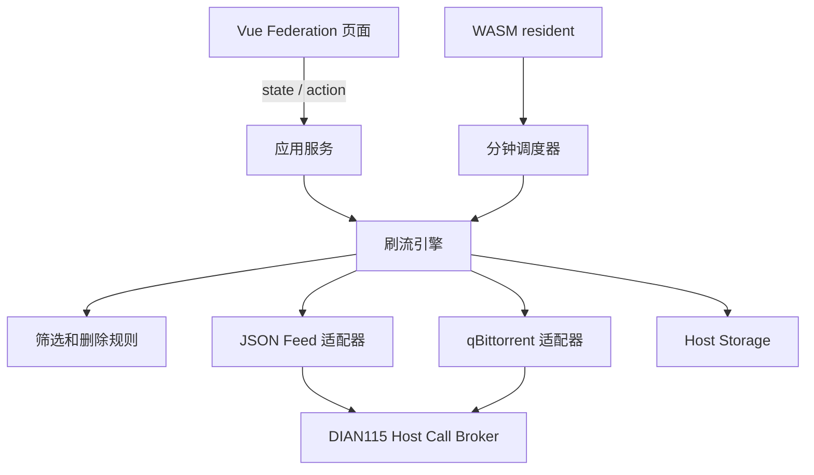

# 架构与安全边界

协议固定在 DIAN115 `7637a392e9512bd0f7965b99445768969eb075fc`，策略含义参考 MoviePilot brushflow 6.1.2。项目不包含 DIAN115 私有主程序源码或 MoviePilot Python 实现。

## 模块

| 路径 | 职责 |
| --- | --- |
| `core/` | 配置、候选、规则校验和筛选决策 |
| `adapters/` | JSON Feed 与 qBittorrent Web API |
| `host/` | Broker 请求、正文编码、Storage envelope、ETag/CAS |
| `app/` | state/action、调度、选种、状态同步、删除和通知 |
| `runtime/` | WASM ABI、JSON-RPC 和 resident 生命周期 |
| `src/` | 联邦管理页与本地 mock |

## 数据与所有权

- `config` 保存站点、下载器和任务。秘密仅保存为不透明 `credential_ref`。
- `runtime` 保存最多 50 次运行报告和全局 150 条托管记录；超过上限时先清理最旧的已删除记录。
- `heartbeat` 保存 resident 最近运行时间、启用任务数及错误摘要。
- 配置更新使用 ETag/If-Match；已有配置不会被陈旧页面覆盖。
- state 根据持久化快照生成稳定 hash 和强 ETag。

添加种子时写入两个标签：`brushflow-<task-id>` 标识任务，`bfid-<candidate-hash>` 标识候选。检查和删除要求下载器种子、持久化记录与候选标签同时匹配。种子名称不用于所有权判断。

## 执行语义

resident 每分钟检查一次任务周期；选种与检查按任务顺序执行。qB 重复添加相同 infohash 本身是幂等的，候选 ID 和标签用于重启后的核对。页面 action 超时不代表外部写入撤销，之后应刷新状态并检查 qB。

删除条件为 OR：任一启用条件满足即可删除。做种时间、分享率和上传量只应用于完成任务；下载超时和免费到期只应用于未完成任务。所有权未知、促销信息无效或 qB 状态无法读取时不执行删除。

标准 Host API 没有完整 PT 浏览和下载器契约，所以网络调用经过 Broker 访问用户配置的 Feed/qB 地址。插件不请求 `host_access: extended`，不猜测宿主内部路由。Broker 会审计请求、限制响应大小并过滤敏感响应头。

## 验收范围

CI 覆盖规则边界、配置冲突、Host Storage、选种添加、双标签删除保护、Vue 构建、公开协议检查及真实 WASM 模块调用。官方 `runtime-smoke.mjs` 只支持旧 process，因此 WASM 使用项目自己的 mock Broker 冒烟测试。

真实宿主仍需验证安装、托管凭据、容器网络、resident 停用/重启和目标 qB 版本。首次部署应保持任务停用，按 README 的安全顺序逐步启用。
