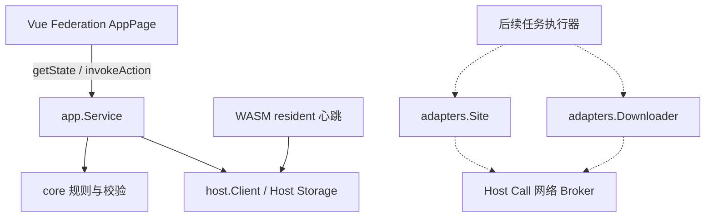

# 架构与迁移边界

协议固定在 DIAN115 `7637a392e9512bd0f7965b99445768969eb075fc`；策略参考 MoviePilot-Plugins `9b9b14bc0f0bb3890b0f699a84f9bd0df063b2e3` 的 brushflow 6.1.2。没有导入 DIAN115 私有主项目源码。

## 模块

| 路径 | 职责 |
| --- | --- |
| `core/` | 平台无关的配置、候选、决策和筛选 |
| `adapters/` | 站点/下载器接口和不可用实现；无实际网络操作 |
| `host/` | Broker JSON、Base64、Storage envelope、ETag 和错误处理 |
| `app/` | 配置读写、state/action、规则预览和后台心跳 |
| `runtime/` | WASM ABI、JSON-RPC 分发、resident 生命周期入口 |
| `src/` | 联邦管理页和明确标识的本地 mock |
| `contracts/dian115/` | 固定提交的公开 Schema、OpenAPI、检查工具 |

## v0.1 数据与操作

- `config`：`schema_version=1`、最多 50 项任务。未提供宿主或下载器凭据字段。
- `heartbeat`：独立 resident 记录时间、启用任务数与 `adapter_unavailable`。
- `save-config`：要求客户端提交读取时的 `revision`；已有值通过 If-Match 写入。初次缺失值创建由唯一服务实例、`max_concurrency=1` 串行处理，resident 不写配置。未来多写入者须增加原子创建/租约协议，不能假定普通内存锁跨实例有效。
- `preview`：按已保存任务规则评估最多 100 个候选，无任何持久化或下载写入。
- state 由持久化快照计算稳定 hash 和强 ETag；相同内容返回相同版本。
- action 输入和单个存储文档主动限制 64 KiB；ABI 输出限制 256 KiB。
- 配置加载错误必须向 UI 报错，不能以默认空配置覆盖已有内容。

## 后续执行设计（未实现）

普通 action 仅写入独立命令记录，resident 作为唯一执行者。命令具有业务 ID、状态、重试记录；下载器超时后先核对 hash/唯一任务标识再重试。UI 超时不表示操作撤回。

种子身份使用 `(downloader_id, infohash)`，任务所有权使用固定 task ID。删种前同时核对数据库归属、下载器标签和保护条件。所有权不明或站点 H&R 信息缺失时不自动删除。

任务间隔由 resident 调度；全局配额在分配前预留，防止多个任务同时超额。进程重启后从持久化记录恢复，不能仅靠内存定时器或锁。

标准 Host API 没有完整 PT 浏览/下载器契约。默认使用独立适配器经 Broker 请求外部服务；`extended` 接口只有在明确宿主路由与版本契约后才接入，不猜测内部路径。当前 manifest 仅申请 Storage 读写，无 extended 权限。

## 验收边界

CI 验证 Go 策略/存储/服务测试、Vue 类型和构建、公开协议检查以及真实 WASM 模块导入/导出。官方 `runtime-smoke.mjs` 仅支持旧 process，因此不能将它作为 WASM 验收。

实际宿主仍须验收：签名安装、state/action 返回、真实 Storage ETag、resident 重启与停用、Federation iframe 内渲染、实际版本能力，以及后续下载器认证。没有运行这些验收前不宣称生产可用。
